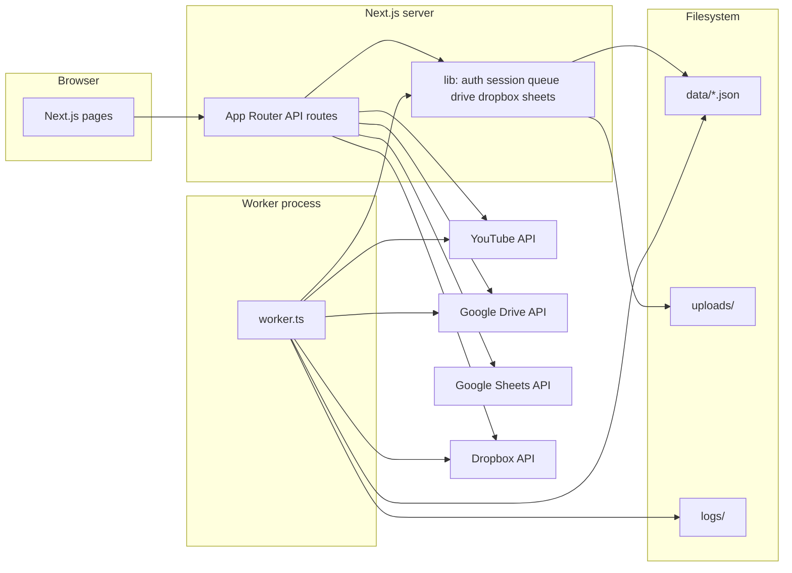

# ZonDiscounts YouTube Video Uploader

**ZonDiscounts Uploader** is a self-hosted web application (not a chat bot) that automates uploading videos to YouTube. It provides a browser dashboard, REST-style API routes, and an optional background worker so large batches do not depend on a single long-lived HTTP request.

You sign in with Google (YouTube Data API), optionally connect Dropbox for cloud file sources, then upload single files, ZIPs, CSV-driven batches, Google Sheet–driven jobs, or bulk file/URL queues with scheduling, thumbnails, and post-upload file actions.

---

## Table of contents

1. [What it does](#what-it-does)
2. [Architecture](#architecture)
3. [Requirements](#requirements)
4. [Installation and local development](#installation-and-local-development)
5. [Environment variables](#environment-variables)
6. [Google Cloud setup](#google-cloud-setup)
7. [Dropbox setup (optional)](#dropbox-setup-optional)
8. [Production deployment](#production-deployment)
9. [Background worker and queues](#background-worker-and-queues)
10. [On-disk data and logs](#on-disk-data-and-logs)
11. [Dashboard overview](#dashboard-overview)
12. [CSV and metadata columns](#csv-and-metadata-columns)
13. [API routes reference](#api-routes-reference)
14. [Operational notes](#operational-notes)
15. [Troubleshooting](#troubleshooting)
16. [License](#license)

---

## What it does

| Capability | Description |
|------------|-------------|
| **Google OAuth** | Connects your Google account; stores OAuth tokens in a server-side session (persisted to disk). |
| **Single video upload** | Upload one video with title, description, privacy, schedule, thumbnail, and optional “made for kids”. |
| **CSV batch (streaming)** | Primary batch path: `POST /api/upload-queue` parses CSV, matches videos/thumbnails (paths, URLs, Drive IDs, Dropbox paths), streams **Server-Sent Events (SSE)** progress to the browser. Can respect scheduling intervals stored in the CSV queue (`data/queue.json`). |
| **Bulk upload (worker)** | `POST /api/upload-bulk` stages files under `uploads/`, enqueues jobs in `data/bulk-queue.json`; **`worker.ts`** drains the bulk queue, talks to YouTube, Drive, Dropbox, or HTTP URLs, applies retries, optional sheet updates, and post-upload actions. |
| **Google Sheets** | `POST /api/upload-sheets` reads rows from a spreadsheet and enqueues bulk jobs (same worker pipeline where applicable). |
| **Google Drive** | Browse/list/download video files by folder or file ID when the Google token has appropriate API scopes. |
| **Dropbox** | Separate OAuth; list/download paths; optional rename/move/delete after upload when configured in metadata. |
| **Scheduling** | Publish-at times and “N videos per interval” style rules (see queue and bulk job fields in `lib/queue.ts` and `lib/bulk-queue.ts`). |
| **History / dedupe** | Successful worker uploads append to `data/uploaded-videos.json` for history and optional duplicate checks. |
| **Account cleanup** | `POST /api/delete-account` revokes Google credentials and clears the local session cookie. |

---

## Architecture



- **Framework:** Next.js 15 (App Router), React 19, TypeScript, Tailwind CSS.
- **Auth:** `lib/auth.ts` builds the Google OAuth2 client; optional Dropbox URLs and token exchange/refresh.
- **Session:** `lib/session.ts` — in-memory map **mirrored to** `data/sessions.json` so restarts keep logins (single-server assumption).
- **Two queue systems:**
  - **`lib/queue.ts`** — “CSV / interval” jobs used heavily by `upload-queue` (legacy naming: `videosPerDay` vs newer `uploadInterval` / `videosPerInterval`).
  - **`lib/bulk-queue.ts`** — file/URL/Drive/Dropbox items processed by **`worker.ts`**.
- **Process model:** In production you typically run **two processes**: `next start` and `tsx worker.ts` (see `ecosystem.config.js` for PM2).

---

## Requirements

- **Node.js** compatible with Next.js 15 (project uses TypeScript 5, `tsx` for the worker).
- **npm** (or compatible client) for dependencies.
- **Google Cloud project** with YouTube Data API v3 enabled and OAuth client credentials.
- **For Drive / Sheets features:** OAuth consent must include the right scopes (see [Google Cloud setup](#google-cloud-setup)); default scopes are YouTube-centric.
- **For Dropbox features:** Dropbox app key/secret and redirect URI.
- **Optional:** [FFmpeg](https://ffmpeg.org/) / `ffprobe` on the server if you rely on duration probing in some paths (worker uses duration helpers when available).

---

## Installation and local development

```bash
git clone <your-repo-url>
cd youtube-video-uploader-nodejs
npm install
```

Create a `.env` file in the project root (see [Environment variables](#environment-variables)).

**Option A — credentials file:** place `src/creds.json` in the shape Google gives for a “Web application” OAuth client (`web.client_id`, `web.client_secret`, `web.redirect_uris`).

**Run the web app:**

```bash
npm run dev
```

Open [http://localhost:3000](http://localhost:3000), sign in with Google, then open the dashboard (the app flow links you after OAuth).

**Run the bulk worker locally** (needed for bulk-queue processing):

```bash
npm run worker
```

Or with auto-restart on file changes:

```bash
npm run worker:dev
```

**Build and production-style run:**

```bash
npm run build
npm run start
```

In another terminal, still run `npm run worker` so bulk jobs complete.

---

## Environment variables

| Variable | Required | Purpose |
|----------|----------|---------|
| `GOOGLE_CLIENT_ID` | Yes* | Google OAuth client ID |
| `GOOGLE_CLIENT_SECRET` | Yes* | Google OAuth client secret |
| `GOOGLE_REDIRECT_URI` | Yes* | Must match an authorized redirect URI (e.g. `http://localhost:3000/api/auth/callback`) |
| `GOOGLE_SCOPES` | No | Space-separated scope override. If unset, full default includes YouTube + userinfo; minimal mode uses YouTube only (see below). |
| `DISABLE_GOOGLE_SCOPES` or `GOOGLE_MINIMAL_SCOPES` | No | If `true`, uses YouTube upload + readonly only (no OpenID/userinfo email in default scope string). |
| `DROPBOX_APP_KEY` | For Dropbox | Dropbox app key |
| `DROPBOX_APP_SECRET` | For Dropbox | Dropbox app secret |
| `DROPBOX_REDIRECT_URI` | For Dropbox | Defaults by replacing `/api/auth/callback` with `/api/auth/dropbox/callback` on the Google redirect base — set explicitly if that does not match your host. |
| `UPLOADS_DIR` | No | Override directory for staged uploads (`update-metadata` route); default is `./uploads`. |
| `WORKER_LOG_JSON` | No | If `1` or `true`, worker logs in JSON form (`lib/worker-logger.ts`). |

\*Or supply equivalent values in `src/creds.json`.

**Drive and Sheets:** Default Google scopes emphasize YouTube and (in full mode) basic profile/email. Reading Drive files and Google Sheets usually requires **additional scopes** configured in the Google Cloud Console consent screen and passed via **`GOOGLE_SCOPES`**. If Drive/Sheet calls return 403, widen scopes and re-consent the user.

---

## Google Cloud setup

1. Create a project in [Google Cloud Console](https://console.cloud.google.com/).
2. Enable **YouTube Data API v3**. Enable **Google Drive API** and/or **Google Sheets API** if you use those features.
3. Configure the **OAuth consent screen** (external user type for a public tool; internal if Workspace-only).
4. Create **OAuth 2.0 Client ID** credentials of type **Web application**.
5. Add **Authorized redirect URIs** exactly matching `GOOGLE_REDIRECT_URI` (dev and production URLs).
6. Copy Client ID and Client Secret into `.env` or `src/creds.json`.

---

## Dropbox setup (optional)

1. Create an app in the [Dropbox App Console](https://www.dropbox.com/developers/apps).
2. Set redirect URI to match `DROPBOX_REDIRECT_URI` (or the derived default).
3. The app requests offline access and scopes: `files.metadata.read`, `files.content.read`, `files.content.write` (for post-upload rename/move/delete).

Users connect Dropbox from the dashboard; tokens are stored alongside the Google session in `data/sessions.json`.

---

## Production deployment

1. Set all production URLs in Google (and Dropbox) consoles.
2. Build: `npm run build`.
3. Run **Next.js** and the **worker** together.

**PM2** (scripts in `package.json`, config in `ecosystem.config.js`):

```bash
npm run pm2:setup    # optional: log rotation
npm run pm2:start    # starts nextjs + bulk-upload-worker
```

Apps defined in `ecosystem.config.js`:

- **`nextjs`** — `next start` on port **3000** (override with `PORT` if you change ecosystem env).
- **`bulk-upload-worker`** — `tsx worker.ts`.

Logs default under `logs/` (`nextjs-*.log`, `worker-*.log`).

**Health check:** `GET /api/health` returns uptime, memory, presence of `data/` and `uploads/`, and the latest **worker heartbeat** from `data/worker-heartbeat.json`.

---

## Background worker and queues

**`worker.ts`** (poll interval ~5 seconds, processes up to **3** parallel tasks per tick — see constants at top of file):

1. Reads the next pending item from **`data/bulk-queue.json`** (`lib/bulk-queue.ts`).
2. Resolves each item’s video stream in priority order: **Drive file ID → Dropbox path → HTTP(S) URL → server file path**.
3. Optionally resolves a **thumbnail** stream with the same priority model.
4. Uploads to YouTube with sanitization (`lib/youtube-utils.ts`), retries (`lib/youtube-retry.ts`), and optional **made for kids** flag.
5. Runs **post-upload actions** on source files when requested (`rename`, `delete`, `move`, `none`).
6. Updates progress on the bulk job, appends **`uploaded-videos.json`**, and writes a **heartbeat** for monitoring.

**`POST /api/upload-queue`** handles the **other** queue (`data/queue.json`) and long CSV runs inside the Next process with SSE — suitable for interactive dashboard progress without the worker.

For large bulk batches, prefer **bulk + worker** so the web server’s request timeout is not the limiting factor.

---

## On-disk data and logs

| Path | Role |
|------|------|
| `data/sessions.json` | Serialized sessions (Google tokens, optional Dropbox tokens). **Sensitive** — protect the server filesystem. |
| `data/queue.json` | CSV/interval jobs for `upload-queue`. |
| `data/bulk-queue.json` | Jobs for `worker.ts`. |
| `data/uploaded-videos.json` | Append-only style history of `videoId`, title, job id, timestamp. |
| `data/worker-heartbeat.json` | Last worker tick metadata for `/api/health`. |
| `uploads/` | Per-user (or session) staging dirs for bulk uploads (`lib/storage.ts`). |
| `logs/` | PM2 log output when using ecosystem defaults. |

**Backup** `data/` if you care about job continuity. **Do not commit** real `sessions.json` or secrets to git.

---

## Dashboard overview

After login, the main **dashboard** (`app/dashboard/page.tsx`) groups:

- **Statistics** — high-level counts and summaries.
- **Upload** tab — single upload, batch CSV (with validation), bulk files/URLs, Drive/Dropbox/Sheets helpers depending on configuration.
- **Queue management** — pause, resume, cancel, delete jobs; inspect files; notes; worker busy/heartbeat indicators.
- **Channels** — list other “channels” (user ids) that have data on disk for multi-account servers.
- **Header** — logout, theme, links; dev-only UI may appear when `NODE_ENV === "development"`.

Static pages such as **Privacy** and **Terms** live under `app/privacy` and `app/terms`.

---

## CSV and metadata columns

The upload-queue route documents row fields in code (`app/api/upload-queue/route.ts`). Typical headers include:

| Column | Meaning |
|--------|---------|
| `youtube_title` | Video title |
| `youtube_description` | Description |
| `path` | Legacy: path or filename hint for matching uploaded files |
| `video_name` | Preferred: explicit video filename for matching |
| `thumbnail_name` / `thumbnail_path` | Thumbnail file matching |
| `video_url` / `thumbnail_url` | Remote file URLs |
| `drive_file_id` / `drive_thumbnail_id` | Google Drive file IDs |
| `url_auth_headers` | JSON object string of HTTP headers for URL fetch |
| `url_timeout` | Timeout in ms for URL downloads |
| `scheduleTime` | Scheduling / publish timing (parsed with `parseDate` utilities) |
| `privacyStatus` | `public`, `private`, or `unlisted` |
| `post_upload_action` | `rename`, `delete`, `move`, or `none` |
| `completed_folder_id` | Destination for `move` (Drive folder ID or Dropbox path depending on source) |

Sheet-based uploads (`upload-sheets`) accept similar logical columns with some alternate casings (`scheduletime`, `publishAt`, `made_for_kids`, etc.) — see `app/api/upload-sheets/route.ts` interface `SheetRow`.

---

## API routes reference

Below is a concise map of `app/api/**/route.ts` endpoints. All require a valid session cookie unless noted. Methods are the typical ones implemented; inspect each route for exact bodies and responses.

**Auth**

| Method | Path | Role |
|--------|------|------|
| GET | `/api/auth/url` | Google authorization URL |
| GET | `/api/auth/callback` | OAuth callback (sets cookie) |
| GET | `/api/auth/logout` | Clear session |
| GET | `/api/auth/dropbox/url` | Dropbox authorize URL |
| GET | `/api/auth/dropbox/callback` | Dropbox OAuth callback |

**User**

| Method | Path | Role |
|--------|------|------|
| GET | `/api/user` | Current user / session summary |

**Uploads**

| Method | Path | Role |
|--------|------|------|
| POST | `/api/upload` | Single video |
| POST | `/api/upload-queue` | Primary CSV batch + SSE progress |
| POST | `/api/upload-csv` | Alternative non-streaming CSV API |
| POST | `/api/upload-bulk` | Enqueue bulk files/URLs for worker |
| POST | `/api/upload-drive` | Drive-oriented upload helper |
| POST | `/api/upload-dropbox` | Dropbox-oriented upload helper |
| POST | `/api/upload-sheets` | Sheet → bulk queue |
| POST | `/api/upload-zip` | ZIP handling |
| GET/POST | `/api/upload-progress` | Long-running copy/staging progress |
| GET | `/api/bulk-status` | Bulk job status |
| POST | `/api/update-metadata` | Metadata / file updates under uploads dir |

**Browse / list**

| Method | Path | Role |
|--------|------|------|
| GET | `/api/browse-drive` | List Drive folder videos |
| GET | `/api/browse-dropbox` | List Dropbox folder |
| GET | `/api/list-all-files` | Aggregated file listing for channel |
| GET | `/api/list-drive-sheets` | Sheets discovery |
| GET/POST | various preview/sheets-info | Sheet preview and metadata |

**Queue**

| Method | Path | Role |
|--------|------|------|
| GET | `/api/queue-status` | Queue + worker heartbeat snapshot |
| POST | `/api/queue-manage` | Pause, resume, cancel, delete jobs |
| POST | `/api/queue-notes` | Attach notes to a job |
| POST | `/api/queue-copy` | Copy job assets |

**Maintenance / exports**

| Method | Path | Role |
|--------|------|------|
| POST | `/api/delete-account` | Revoke Google token, clear session |
| POST | `/api/delete-videos` | Bulk delete videos (YouTube) — use with care |
| GET | `/api/export-stats` | Export statistics |
| GET | `/api/export-job` / `/api/export-pending` | Job export helpers |
| POST | `/api/migrate-files` | Migrate files between directories |

**Misc**

| Method | Path | Role |
|--------|------|------|
| GET | `/api/health` | Server + worker heartbeat (no auth) |
| GET | `/api/channels` | List channels/users with data |
| GET | `/api/download-file` | Download helper |
| GET | `/api/uploaded-videos` | Upload history JSON or `?format=csv` |
| POST | `/api/uploaded-videos` | Body `{ titles: string[] }` — duplicate title check vs history |
| DELETE | `/api/uploaded-videos` | Clears local history file only (not YouTube) |

---

## Operational notes

- **Single-server file sessions:** `sessions.json` and JSON queues are not safe for horizontal scale without a shared store (Redis, database, object storage).
- **Secrets:** Never expose `.env` or `data/sessions.json`. Use HTTPS in production and `secure` cookies (already tied to `NODE_ENV === "production"` in auth callbacks).
- **YouTube quotas:** Bulk uploads consume quota quickly; monitor [quota usage](https://console.cloud.google.com/apis/api/youtube.googleapis.com/quotas) in Google Cloud.
- **Worker must run:** Bulk queue items stay `pending` until `worker.ts` is running on the same machine (same `data/` directory).
- **CSV validation on dashboard:** Client-side checks require headers including `youtube_title`, `youtube_description`, and `path` — align exports with that if you use the built-in validator.

---

## Troubleshooting

| Symptom | Things to check |
|---------|------------------|
| OAuth “redirect_uri_mismatch” | Google Console redirect URIs must exactly match `GOOGLE_REDIRECT_URI`. |
| Drive or Sheets 403 | Add appropriate scopes to the Cloud project and set `GOOGLE_SCOPES`; user must sign in again. |
| Bulk jobs never finish | Is `npm run worker` or PM2 `bulk-upload-worker` running? Check `logs/worker-*.log` and `/api/health`. |
| Dropbox errors | `DROPBOX_*` env vars, redirect URI, and app permissions (scopes). |
| Missing files after upload | Post-upload `move`/`delete` actions; check `post_upload_action` in CSV/sheet rows. |

---

## Project structure (abbreviated)

```
├── app/
│   ├── api/                 # Route handlers (auth, upload, queue, …)
│   ├── dashboard/           # Dashboard page + hooks
│   ├── components/          # UI components (dashboard, layout, …)
│   ├── page.tsx             # Landing / sign-in
│   └── …
├── lib/
│   ├── auth.ts              # Google + Dropbox OAuth helpers
│   ├── session.ts           # File-backed sessions
│   ├── queue.ts             # queue.json job model
│   ├── bulk-queue.ts        # bulk-queue.json job model
│   ├── drive.ts / dropbox.ts / sheets.ts
│   ├── storage.ts           # uploads/ staging paths
│   ├── youtube-utils.ts / youtube-retry.ts
│   └── …
├── worker.ts                # Bulk upload worker entrypoint
├── ecosystem.config.js      # PM2: next + worker
├── data/                    # Created at runtime (gitignored in practice)
├── uploads/                 # Staged files
└── src/creds.json           # Optional OAuth JSON (not committed)
```

---

## License

ISC
